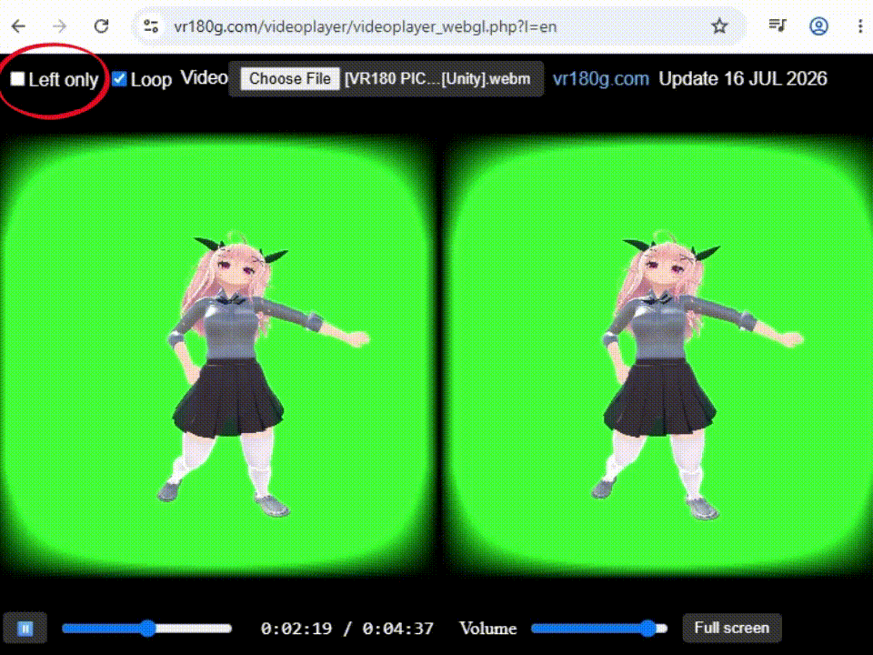

# R800ZZ-WebGL-Video-Player
HTML/JavaScript Video player. Supports displaying only the left side of SBS videos. Multi-language support (7 languages).

## Features
- When watching SBS videos in non-VR environments, it supports displaying only one side (left view).
- In combination with **R800ZZ Browser** (not yet released), it enables VR video playback with green chroma key passthrough.

## Tested Devices
- PICO 4 Ultra + R800ZZ Browser(This browser is not yet released.)
- Windows 11 PC + Firefox/Edge/Chrome

## Libraries Used
Three.js

## Related Software
- **R800ZZ Browser** (not yet released)
- **R800ZZ VR Player for PICO 4 Ultra/PICO 4** https://vr180g.com/pico/vrplayer.php?l=en
- **R800ZZ SBS Video Player for Windows** https://vr180g.com/r800zzplayer/r800zzplayer.php?l=en

## Version
0.3 — There are some differences compared to the official online site version (such as whether PHP is used).

# Web application. Run in web browser
The web application is available at vr180g.com  
- English https://vr180g.com/videoplayer/videoplayer_webgl.php?l=en  
- Русский https://vr180g.com/videoplayer/videoplayer_webgl.php?l=ru  
- Español https://vr180g.com/videoplayer/videoplayer_webgl.php?l=es  
- ภาษาไทย https://vr180g.com/videoplayer/videoplayer_webgl.php?l=th  
- 中文 https://vr180g.com/videoplayer/videoplayer_webgl.php?l=cn  
- 한국어 https://vr180g.com/videoplayer/videoplayer_webgl.php?l=kr   
- 日本語 https://vr180g.com/videoplayer/videoplayer_webgl.php?l=jp

## Files
- English: videoplayer_webgl_en.html  
- Spanish: videoplayer_webgl_es.html  
- Japanese: videoplayer_webgl_ja.html  
- Korean: videoplayer_webgl_ko.html  
- Russian: videoplayer_webgl_ru.html  
- Thai: videoplayer_webgl_th.html  
- Chinese: videoplayer_webgl_zh.html

## How to Use Locally
The current source loads Three.js online.  
To use Three.js offline, you need to install it locally and change the path in the HTML import map.  
I do not provide an example of how to modify the import map in this README.

For example, if you place the HTML file in `"C:\web\"` on Microsoft Windows 11,  
you can access it by entering the following in the web browser’s URL bar:  
`file:///C:/web/videoplayer_webgl_en.html`  

On Microsoft Windows with Edge/Chrome, you can also enter:  
`C:\web\videoplayer_webgl_en.html`

When trying to access a local file by entering its URL on an Android-based OS (I have not tested this myself):  
`file:///storage/emulated/0/web/videoplayer_webgl_en.html`

## Multilingual Processing
This repository distributes one HTML file for each language.  
The original source code is a single PHP file that outputs HTML for each language.  
The PHP source code is not currently published.  
Unless there are special circumstances, PHP is not considered necessary.

